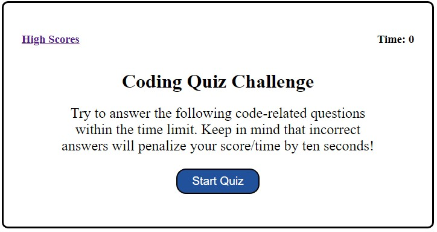

# Weekly Challenge 04 Create a timed multiple choice coding assessment quiz.

## URL to Application

https://greg4949.github.io/coding-assessment-quiz/#highscores

## Description

The purpose of this project was to create a web based timed multiple choice coding quiz that allows the user to store their initials and score.

## Installation

N/A

## Usage

Coding quiz application can be accessed at the URL listed at the top of the README.  Clicking the start quiz button will start a timer and trigger a series of multiple choice questions for user to answer.  When a user selects an answer, the application will let the user know if answer was correct and move to the next question. For each wrong question, 10 seconds will be deducted from the timer.  The quiz is over when all questions have been answered or timer reaches zero.  Once quiz is over, the user's quiz score will be shown and user will have the option to enter their initials and save their score.  Application also contains a link to show a list of high scores.

## Credits

N/A

## License

Please refer to the LICENSE in the repo.